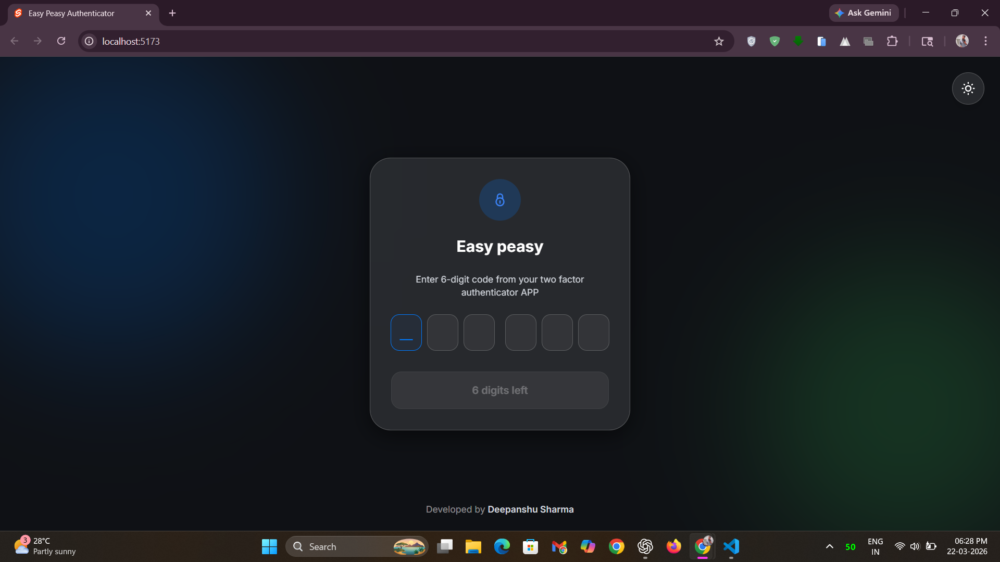
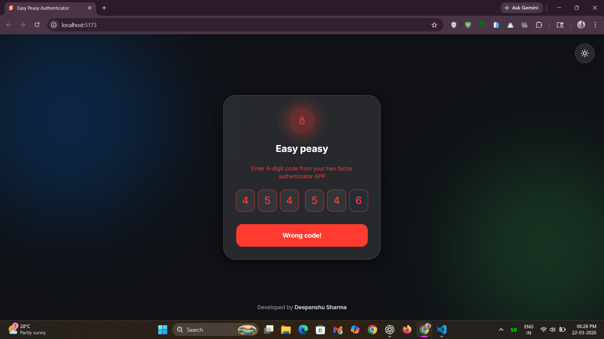
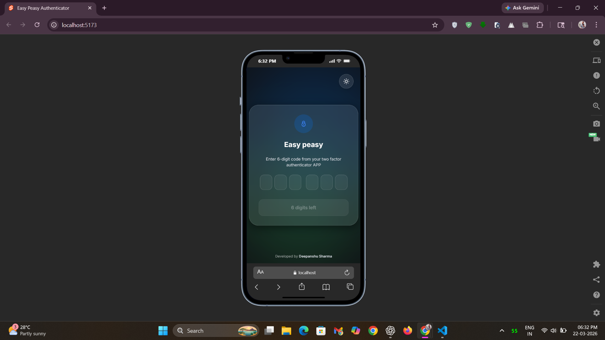

# 🔓 2-Factor Authentication Component 🔓


- A beautiful, responsive, and accessible 2-Factor Authentication (2FA) component built with SvelteKit, Vite,  
  Tailwind CSS, Vanilla CSS, and JavaScript (ES6+). 
- Enables secure OTP-based authentication for enhanced account protection, with smooth animations, full keyboard 
  navigation, and production-ready security.

🌐 Live Demo : [View Live](https://your-live-link.com)

## 📸 Screenshots

### 🔐 Base State


*Clean and minimal default interface for entering OTP.*

### ✅ Success State


*Smooth visual feedback when authentication is successful.*

### ❌ Error State


*Clear error indication for incorrect OTP input.*

### 📱 Responsive Design


*Fully optimized layout across mobile, tablet, and desktop devices.*

### 🌞 Light Mode UI


*Elegant and readable light theme experience.*

## ✨ Features

### 🎨 **Visual Design**
- Modern, clean interface with smooth animations
- Responsive design that works on all devices
- Status-based color coding (default, success, error)
- Animated pulse waves for visual feedback
- Smooth digit drop animations
- Custom cursor animations with slide-up effect

### 🚀 **User Experience**
- **Keyboard Navigation**: Full arrow key, backspace, and tab support
- **Paste Support**: Ctrl+V and right-click paste functionality
- **Auto-advance**: Automatically moves to next field after input
- **Auto-submit**: Submits when all 6 digits are entered
- **Error Handling**: Visual feedback for invalid codes
- **Loading States**: Smooth loading animations during verification

### ♿ **Accessibility**
- Screen reader compatible
- High contrast mode support
- Keyboard-only navigation
- Focus management
- ARIA labels and descriptions
- Semantic HTML structure

### 🔧 **Developer Experience**
- TypeScript support ready
- Comprehensive API
- Customizable validation
- Event callbacks
- Easy integration
- Well-documented code

### Events

| Event | Payload | Description |
|-------|---------|-------------|
| `success` | `{ code: string }` | Fired on successful verification |
| `error` | `{ code: string, attempts: number }` | Fired on verification failure |
| `input` | `{ code: string, isComplete: boolean }` | Fired on each input change |
| `paste` | `{ code: string }` | Fired when code is pasted |
| `reset` | None | Fired when component is reset |

## 📦 Setup & Installation

1. **Clone the repository**
```bash
git clone https://github.com/deepanshu1420/2-Factor-Authentication-Component.git
cd Two-Factor-Authentication-component
```

2. **Install dependencies**
```bash
npm install
# or
yarn install
# or
pnpm install
```

3. **Start development server**
```bash
npm run dev
# or
yarn dev
# or
pnpm dev
```

4. **Open in browser**
```
http://localhost:5173
```


